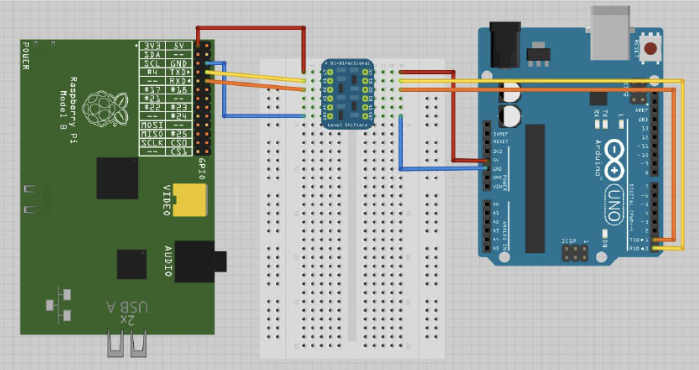

# Exercício 2 - UART-MODBUS

Exercício de comunicação UART utilizando o protocolo MODBUS na Raspberry Pi

## 1 - OBJETIVOS

O objetivo deste trabalho é aprimorar a robustez da comunicação UART criada no [Exercício 1](https://gitlab.com/fse_fga/projetos_2020_2/exercicio-1-uart) a partir da adaptação do padrão de mensagens do protocolo MODBUS.

## 2 - PROTOCOLO MODBUS

O Modbus é um protocolo de comunicação da camada de aplicação ([Modelo OSI](https://pt.wikipedia.org/wiki/Modelo_OSI)) muito utilizado em comunicação serial com as interfaces físicas RS-232, RS-485 e Ethernet. 

Há três variações do protocolo sendo elas o Modbus RTU (Remote Terminal Unit), Modbus ASCII e o Modbus TCP. Em todos os casos, o protcolo funciona em modo cliente-servidor (master-slave) onde o cliente inicia a comunicação e o servidor (ou servidores) responde. Em modo RS-232, geralmente a comunicação é ponta-a-ponta entre dois dispositivos enquanto no RS-485, é possível conectar até 127 dispositivos no mesmo barramento. 

Este trabalho irá se basear no Modbus RTU em modo de comunicação ponta-a-ponta entre dois dispositivos. 

O formato genérico de uma mensagem do Modbus RTU é composto por 4 partes distintas definidas na tabela à seguir.

| *A.* Endereço do dispositivo | *B.* Código da função  | *C.* Dados  | *D.* CRC-16  |
|:-:|:-:|:-:|:-:|
| 1 byte | 1 byte | n bytes  | 2 bytes |

*A.* O **primeiro byte** define o endereço do dispositivo a ser acessado. Quando se usa a comunicação ponto-a-ponto este endereço pode ser definido como 0x0 ou 0x1 já que será único. 

*B.* O **segundo byte** define o código da função ou comando a ser enviado. Neste caso, o protocolo Modbus define um conjunto de funções públicas pré-definidas para que os fabricantes de produtos mantenham um padrão, além de uma área reservada para funções customizadas. Nas respostas padrão, o servidor retorna o mesmo código enviado pelo cliente e em caso de erro, retorna o mesmo código com o bit mais significativo invertido (igual a 1).

*C.* Os **n bytes** de dados são preenchidos de acordo com a função ou comando sendo inclusive serem omitidos. O comprimento dos dados depende de cada função e pode ser variável onde, neste caso, é comum que o primeiro byte ou os dois primeiros bytes indiquem o seu comprimento. É comum utilizar o campo da dados para enviar inclusive parte complementar do comando como sub-comandos, endereço de registradores e quantidade de dados a serem enviados além da mensagem. Em caso de erro, o campo de dados pode ser utilizado para retornar ao solicitante um código de exceção.

*D.* Os últimos dois bytes são um código CRC-16 (Cyclic Redundancy Check) calculados à partir do corpo da mensagem para auxiliar na verificação de erros. Existem vários algoritmos para calcular o valor de CRC de 16 bits. O Modbus geralmente utiliza o CRC-16, também conhecido como CRC-16-ANSI ou CRC-16-IBM.

## 3 - CIRCUITO ESQUEMÁTICO

Como plataforma será utilizada a placa Raspberry Pi conectada a um Arduino onde a comunicação será estabelecida pela porta serial UART através dos pinos 8 (UART_TXD) e 10 (UART_RXD) do Raspberry Pi e os respectivos pinos RX, TX do Arduino. Porém, é necessário observar que o Raspberry Pi opera a uma tensão de 3.3V enquanto a maioria das placas Arduino operam em 5V. Neste caso será necessário a utilização de algum método de conversão de tensão (Level Shifter, Divisor de Tensão, Optoacopladores, etc.).

## 4 - Lista de Códigos 

Neste exercício, vamos modificar os códigos do Exercício 01 para nos adequar ao padrão do Modbus. Sendo assim utilizaremos o código 0x23 que é reservado para leitura/escrita de múltiplos registradores (no caso estaremos lendo e escrevendo em 2 registradores de 16 bits por vez) seguido de um sub-código que indicará o endereço de cada registrador.

Tabela 1 - Códigos do Protocolo de Comunicação

| Código |	Sub-código | Comando de Solicitação de Dados |	Mensagem de Retorno |
|:-:|:-:|:--|:--|
| **0x23** | **0xA1** |	Solicitação de dado inteiro: **integer** | int (4 bytes) |
| **0x23** | **0xA2** |	Solicitação de dado real: **float**	| float (4 bytes) |
| **0x23** | **0xA3** |	Solicitação de dado do tipo string: **char[]** | char (1 byte com o tamanho da string) + char |
| **0x16** | **0xB1** |	Envio de um dado no formato **integer**	| int (4 bytes)
| **0x16** |  **0xB2** |	Envio de um dado no formato **float** | float (4 bytes)
| **0x16** |  **0xB3** |	Envio de uma string: **char[]**	| char (1 byte com o tamanho da string) + char

Neste caso, como exemplo, a mensagem completa para a solicitação de um inteiro será:

| Mensagem | *A.* Endereço do dispositivo | *B.* Código da função  | *C.* Dados  | *D.* CRC-16  |
|:--|:-:|:-:|:-:|:-:|
| Solicita inteiro | **0x01** | **0x23** | **0xA1** | 2 bytes |
| Envia o inteiro 3245 | **0x01** | **0x16** | **0xB1** 0x00 0x00 0x0C 0xAD | 2 bytes |

## 5 - ROTEIRO

1. Criar um programa em C, no Raspberry Pi, capaz de implementar a comunicação UART utilizando o protocolo MODBUS com os comandos especificados acima para a escrita e leitura de dados.

2. Imprimir em tela as mensagens que estão sendo enviadas e as respectivas respostas, incluindo os eventuais códigos de erro.

3. O programa deverá ser estruturado em funções e cada acesso à porta serial deve ser feito abrindo e fechando o arquivo referente ao device UART para evitar concorrência com outros usuários.

3. Finalmente, cada função de solicitação de dados ou de envio de comandos deverá ser acessada através de um menu na linha de comando.

## 6 - OBSERVAÇÕES

O código pode ser testado no Linux, porém terá que ser compilado para rodar no Raspberry Pi em sala de aula.

O código base em C para o uso da UART no Raspberry Pi se encontra em: 
[Código UART](https://gitlab.com/fse_fga/uart_raspberry_pi)

A função de CRC-16 a ser utilizada encontra-se na pasta CRC deste repositório.

## 7 - REFERÊNCIAS

Especificações do MODBUS:  
[Modbus Organization - modbus.org](https://modbus.org)  
[MODBUS APPLICATION PROTOCOL SPECIFICATION V1.1b3](https://modbus.org/docs/Modbus_Application_Protocol_V1_1b3.pdf)  
[MODBUS - Wikipedia](https://pt.wikipedia.org/wiki/Modbus)  

Artigos descrevendo o uso do MODBUS:

https://www.embarcados.com.br/protocolo-modbus/  
http://mundoprojetado.com.br/modbus-rtu-o-que-e-e-como-funciona/  
https://www.cooking-hacks.com/documentation/tutorials/modbus-module-shield-tutorial-for-arduino-raspberry-pi-intel-galileo/index.html

CRC:  
[CRC](https://pt.wikipedia.org/wiki/CRC)  
http://www.sunshine2k.de/articles/coding/crc/understanding_crc.html#ch5  

